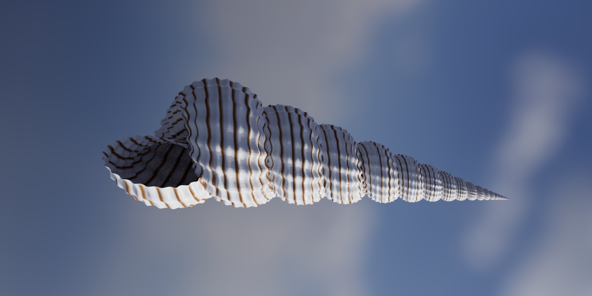
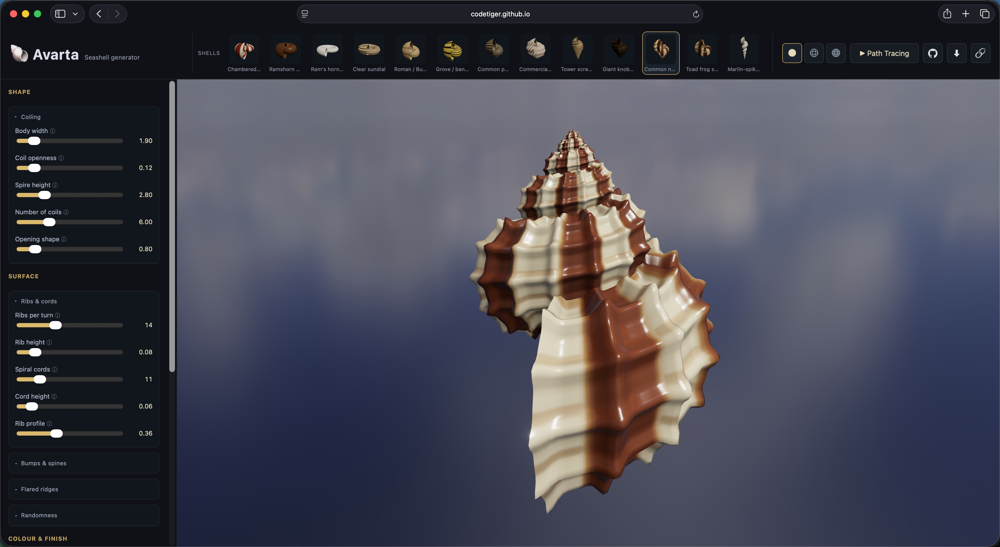

# Avarta

[](https://codetiger.in/avarta/)

Avarta builds the 3D shape of a seashell from a small set of numbers and renders it in the
browser in real time. The shape, the surface sculpture, and the colour banding are all
computed, not modelled by hand.

Live demo: https://codetiger.in/avarta/

The name is Sanskrit (आवर्त, "whorl" or "coil"). A Rust core sweeps a logarithmic spiral to
lay down the coiled tube, then runs a small reaction–diffusion simulation along the growing
edge to produce the colour pattern, roughly the way a real mollusc grows its shell. That math
compiles to WebAssembly, and a Three.js front end draws the result.

Move the sliders and a garden snail turns into a Nautilus, or a tall auger, or a spiny murex.
Switch on the path tracer for a clean still image. Copy the share link and anyone who opens it
sees the exact same shell.

For the parameter model see [`parameters.md`](./parameters.md), and for what the model can and
can't represent see [`scope.md`](./scope.md).

## What it does



The controls sit on the left, a gallery of real species runs along the top, and the viewport
updates as you drag. The sections below describe what each group of controls does.

**Coiling.** Five controls cover the standard Raup parameters for coiled shells: whorl
expansion (W), distance from the axis (D), translation along the axis (T), the number of
whorls, and the aperture shape. Between them they reach most common forms, from a flat
planispiral to a tall spire to a wide open coil.

**Surface sculpture.** Axial ribs and spiral cords that can cross into a cancellate lattice,
projections that range from blunt nodules to long spines, thick varices like the ones on a
murex, and a seeded jitter that takes the edge off the machine-perfect symmetry. The jitter is
deterministic, so the same seed always gives the same shell.

**Colour pattern.** The pigment is generated, not painted on. A one-dimensional
reaction–diffusion line (the Meinhardt model from *The Algorithmic Beauty of Sea Shells*) runs
along the lip of the aperture and advances one step per growth ring, so the pattern you see is
the history of the growing edge. There are seven regimes: solid, spiral bands, axial stripes,
oblique lines, chevrons (the "tented" look of *Conus textile*), spots, and reticulation.

**Material and colour.** A three-colour palette and a physical material: matte through to
glossy porcelain, opaque through to translucent, with an option for nacre-like iridescence.

**Rendering.** The live viewport uses physically based shading with image-based lighting,
ambient occlusion, tone mapping, and bloom. For a final image there is a path-traced render
mode. You can also switch between solid, wireframe, and combined views.

**Sharing.** One button copies a link that holds the whole design (shape, pigment, palette, and
finish) in the URL. There is a small gallery of real species to start from, and the layout
works on a phone.

## How it's built

The model has four layers, and they line up with the code:

| Layer | What it covers | Where it runs |
|------:|----------------|---------------|
| 1. Coiling geometry | Raup W/D/T spiral, whorls, aperture | Rust, WASM |
| 2. Ornamentation | ribs, cords, nodules/spines, varices, jitter | Rust, WASM |
| 3. Pigmentation | Gray–Scott reaction–diffusion at the growing lip | Rust, WASM |
| 4. Colour and finish | three-colour palette, physical material | JS (viewer) |

The first three layers are Rust compiled to WebAssembly, so changing them regenerates the mesh.
The fourth runs in the viewer, which means recolouring or changing the finish is a quick texture
rebake with no geometry rebuild. The pigment uses the same growth sweep as the geometry, so it
lands on the existing UVs without distortion.

## Running it locally

You need Rust (stable) with the wasm target, wasm-pack, and Node 18 or newer.

```sh
# 1. test the pure math natively (fast, no wasm toolchain needed)
cargo test -p avarta-core

# 2. build the wasm package into web/pkg/  (add --release for prod-sized output)
wasm-pack build crates/avarta-wasm --target web --out-dir ../../web/pkg

# 3. run the dev server (installs deps on first run)
cd web && npm install && npm run dev
# then open http://localhost:8090
```

Vite serves the `.wasm` as a static file, so a Rust change won't show up until you rebuild it
(step 2). The JavaScript and HTML hot-reload as usual. `three` and `three-gpu-pathtracer` are
bundled as a single shared `three` instance, which the path tracer requires.

## Embedding it

The viewer is a custom element that renders into its own shadow DOM. Build the app, then point
at the bundle in `web/dist` and set the shape with attributes:

```html
<avarta-viewer w="2.0" d="0.15" t="1.5" n="5" aspect="1.0"></avarta-viewer>
```

## Layout

```
crates/avarta-core   Pure Rust mesh math: Raup W/D/T spiral, ornament, and seeded jitter
                     (Layers 1-2), reaction-diffusion pigment (Layer 3), and the share-id codec.
                     No JS or wasm deps, so it runs under plain `cargo test`.
crates/avarta-wasm   wasm-bindgen adapter: JS typed arrays (positions/normals/uvs/indices/
                     pigment), the parameter range tables, and share-id encode/decode.
web/                 Vite app: index.html control panel and the <avarta-viewer> component (Layer 4).
harness/             Python and Node comparison rig that renders each species next to a real
                     reference photo for shape matching (see harness/README.md).
.github/workflows    CI quality gates: format, lint, native tests, and wasm + web build.
```

A few notes if you work on the code:

- Parameter ranges live in one place. A Rust table (`PARAM_RANGES` and `PIGMENT_RANGES`) holds
  the min, max, step, and default for every control. The UI reads it through wasm and the
  generator clamps to it, so the two can't drift apart. Adding a row wires up the slider, the
  clamping, and the share link together.
- Share links are bit-packed. A link looks like `#s=<mesh>.<look>`. The mesh half (shape and
  pigment) is packed in Rust down to the slider step; the look half (palette and finish) is
  packed in JS. Both skip anything left at its default, so a plain Nautilus is a few characters
  while a fully ornamented shell stays short. Each half carries a version byte, so an old link
  fails cleanly instead of decoding to the wrong shell.
- The mesh is normalised in Rust. It comes out centred, unit-sized, and oriented (spire up,
  aperture toward +Z), so the viewer needs no transform and the path tracer gets clean
  coordinates.
- There is a comparison harness. `harness/` renders each catalogued species through the same
  wasm the web page uses and lines it up next to a reference photo, so you can judge the match
  by eye. The coverage ratings double as a to-do list.

## Tests and CI

The math core is unit-tested on its own with `cargo test -p avarta-core`, no wasm toolchain
needed. Every push and pull request runs those tests along with `cargo fmt --check` and
`clippy -D warnings`, then rebuilds the wasm and the web app to confirm both still build
(`.github/workflows/ci.yml`). Deployment of the [live demo](https://codetiger.in/avarta/) is
handled outside this repo.
